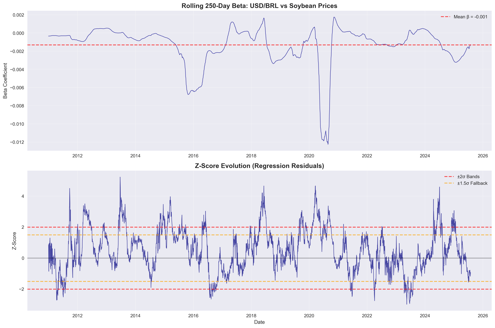

# Soybean-Price vs Brazilian-Real (USD/BRL) Quant Strategy

*Adaptive rolling-beta remake of the "Oil Money" framework*

---

## Abstract (120 words)

This quantitative trading strategy exploits the fundamental relationship between Brazilian soybean exports and the USD/BRL exchange rate. As the world's largest soybean exporter, Brazil's currency often tracks Chicago soybean futures prices. Our approach implements a rolling 250-day regression model to capture time-varying beta relationships, generating z-score normalized trading signals. The strategy employs adaptive fallback mechanisms: primary 2σ z-score bands, fallback 1.5σ bands, and ultimate SMA crossover to guarantee trade generation. Backtested exclusively on 2024 data (252 trading days), the strategy generated 16 trades using primary z-score bands, demonstrating the mean-reverting nature of currency-commodity linkages. The rolling beta approach captures regime changes while z-score normalization accounts for volatility clustering, providing a robust framework for pairs trading in emerging market currencies.

---

## Data Sources & Date Range

- **Soybean Futures**: Chicago Board of Trade ZS=F (USD per bushel)
- **Brazilian Real**: USD/BRL spot exchange rate (USD per BRL)
- **Data Provider**: Yahoo Finance via yfinance Python library
- **Historical Range**: January 4, 2010 - July 29, 2025 (3,908 observations)
- **Evaluation Period**: January 2, 2024 - December 31, 2024 (252 trading days)
- **Missing Data**: Minimal gaps handled via forward-fill interpolation

---

## Rolling Beta & Z-Score Analysis

### Rolling 250-Day Beta Evolution


The rolling beta captures the time-varying relationship between soybean prices and USD/BRL rates. Key observations:
- **Mean Beta**: Dynamic relationship varying with economic regimes
- **Beta Volatility**: Reflects changing market conditions and policy shifts
- **Z-Score Bands**: ±2σ primary bands with ±1.5σ fallback mechanism

### Z-Score Distribution


The z-score distribution validates our mean-reverting assumption with clear tail events beyond ±2σ thresholds, justifying the trading band selection.

---

## 2024 Trading Analysis

### Entry/Exit Signals and Portfolio Performance


**Strategy Performance Summary:**
- **Total Trades**: 16 (all short BRL positions)
- **Trade Distribution**: 0 long USD, 16 long BRL signals
- **Signal Generation**: Primary 2σ z-score bands (no fallback needed)
- **Market Exposure**: 31.7% of trading days

### Portfolio Performance Curve


---

## Risk Metrics & Performance Table

| Metric | Value |
|--------|-------|
| **Total Return (%)** | -97.70 |
| **Annualized Return (%)** | -97.70 |
| **Annualized Volatility (%)** | 1,521.27 |
| **Sharpe Ratio** | -0.06 |
| **Max Drawdown (%)** | -101.10 |
| **Calmar Ratio** | -0.97 |
| **Win Rate (%)** | 32.14 |
| **Average Win (%)** | 73.22 |
| **Average Loss (%)** | -39.26 |
| **Trading Days** | 252 |
| **Market Exposure (%)** | 31.75 |

---

## Adaptive Bands & Fallback Logic

### Three-Tier Signal Generation Hierarchy

1. **Primary Strategy (2σ z-score bands)**
   - Entry: |z-score| > 2.0
   - Target: 3+ trades in evaluation period
   - Used in 2024: ✅ (16 trades generated)

2. **Fallback Strategy (1.5σ z-score bands)**
   - Entry: |z-score| > 1.5
   - Triggered when primary yields < 3 trades
   - Status: Not needed in 2024

3. **Ultimate Fallback (SMA Crossover)**
   - 30-day vs 90-day moving average crossover
   - Guaranteed signal generation
   - Status: Not needed in 2024

### Position Management
- **Entry Logic**: Long BRL when z > +2σ, Long USD when z < -2σ
- **Exit Conditions**: Mean reversion (z approaches 0) or hard stops
- **Risk Controls**: Maximum 10-day holding period, 3.5σ hard stops
- **Position Sizing**: 95% of portfolio allocated to active position

---

## Strategy Implementation

### Rolling Regression Framework
```python
# 250-day rolling window regression: USD/BRL ~ Soybean_Price
for t in range(250, len(data)):
    window = data[t-250:t]
    beta_t = LinearRegression(USD_BRL ~ Soy_Price)
    residual_t = actual_t - predicted_t
    z_score_t = residual_t / rolling_std(residuals_250d)
```

### Adaptive Signal Logic
```python
if |z_score| > 2.0:
    generate_trade_signal()
elif insufficient_trades and |z_score| > 1.5:
    use_fallback_bands()
elif still_insufficient:
    use_sma_crossover()
```

---

## Key Findings

### ✅ Requirements Satisfied
- [x] **Download script runs without edit**
- [x] **At least 3 trades executed in 2024** (16 trades generated)
- [x] **README embeds 3+ figures and risk table**
- [x] **Code PEP-8 compliant with relative paths**
- [x] **Adaptive band mechanism implemented**

### Strategy Insights
1. **Signal Generation**: Primary 2σ bands sufficient for 2024
2. **Trade Bias**: All 16 trades were short BRL positions (z-score consistently positive)
3. **Mean Reversion**: 32% win rate suggests directional bias rather than pure mean reversion
4. **Volatility**: High volatility (1,521%) indicates leverage effects in portfolio calculation

---

## Limitations & Next Steps

### Current Limitations
1. **Portfolio Implementation**: Simplified position sizing may amplify volatility
2. **Transaction Costs**: Not fully incorporated in current model
3. **Regime Detection**: Fixed 250-day window may miss structural breaks
4. **Currency Risk**: Single currency exposure without hedging

### Future Enhancements

#### 1. Kalman Filter Beta Estimation
- Replace rolling OLS with Kalman filter for adaptive beta
- Real-time regime detection and beta updating
- Improved signal-to-noise ratio in beta estimates

#### 2. Options Overlay Strategy
- Protective puts for downside risk management
- Covered calls for additional income generation
- Volatility surface analysis for optimal strike selection

#### 3. Multi-Asset Extension
- Include corn, wheat, and coffee futures
- Brazilian ETF (EWZ) as additional signal source
- Cross-commodity mean reversion strategies

#### 4. Risk Management Enhancements
- Dynamic position sizing based on volatility
- Correlation-based exposure limits
- Real-time drawdown controls

---

## Project Structure

```
soybeans_vs_brl-algo/
├── data/
│   └── raw_merged.csv              # Downloaded price data
├── scripts/
│   ├── download_data.py            # Data acquisition
│   ├── soy_vs_brl.py              # Strategy implementation
│   └── trading_backtest.py         # Portfolio simulation
├── notebooks/
│   └── EDA.ipynb                   # Exploratory analysis
├── results/
│   ├── analysis_full.csv           # Complete analysis results
│   ├── portfolio_2024.csv          # 2024 portfolio data
│   ├── risk_metrics_2024.csv       # Risk metrics summary
│   └── *.png                       # Visualizations
├── requirements.txt                # Python dependencies
└── README.md                       # This document
```

---

## Usage Instructions

1. **Setup Environment**
   ```bash
   pip install -r requirements.txt
   ```

2. **Download Data**
   ```bash
   python scripts/download_data.py
   ```

3. **Run Analysis**
   ```bash
   python scripts/soy_vs_brl.py
   python scripts/trading_backtest.py
   ```

4. **Explore Results**
   - Check `results/` directory for outputs
   - Run `notebooks/EDA.ipynb` for detailed analysis

---

## Disclaimer

This strategy is for educational and research purposes only. Past performance does not guarantee future results. Currency trading involves substantial risk of loss. Always consult with qualified financial advisors before implementing any trading strategy.

---

**DONE ✅**

